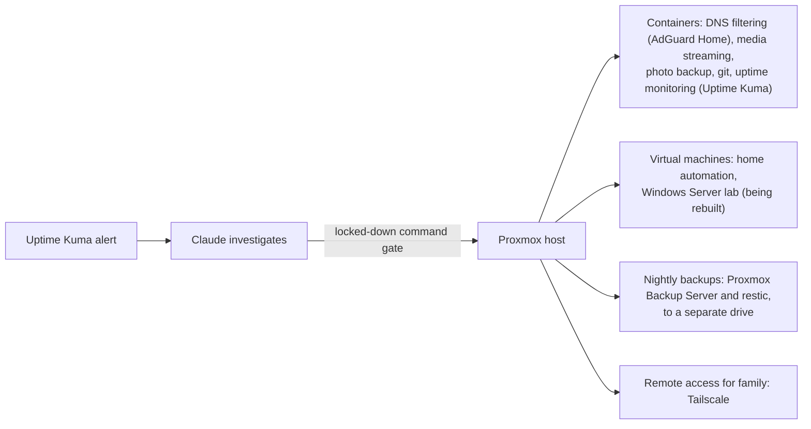

## Caleb Boddington

IT Technician at behold.ai since July 2026, doing Microsoft 365 and SharePoint work. I'm moving towards cyber security, and this is where the lab work goes, including the parts that broke.

### The home server

A Proxmox box in a cupboard at home, built in September 2026. Everything I build now goes on it.

The piece I'd defend in an interview is **[homelab-support-desk](https://github.com/Caleb-Boddington/homelab-support-desk)**. When Uptime Kuma sees an app go down, Claude investigates through a locked-down command gate on the host and sends one plain-English message to my phone. Its permissions come from an SSH key pinned to that gate, so it can restart the app that crashed and nothing else. On 23/09/2026 I stopped my git server on purpose; it was found, restarted, checked and reported in about 75 seconds. That's one real test on one server, so the repo is marked experimental.

I also proved the backups the only way that counts: a test restore, checked byte for byte.

### What's built, what's being rebuilt, what's next

| Build | What it covers | Status |
| --- | --- | --- |
| Proxmox home server | Containers and VMs, DNS filtering, VPN remote access, nightly deduplicated backups | Running since September 2026 |
| AI-assisted support desk | Uptime Kuma alerts, Claude triage through a locked-down command gate, approved fixes only | Running since 23/09/2026, [public repo](https://github.com/Caleb-Boddington/homelab-support-desk) |
| Active Directory domain | Windows Server 2025, `lab.internal`, OUs for IT, Sales, Finance and HR, users bulk-created in PowerShell | Built in VirtualBox in August 2026 and taken down on 20/09/2026. Rebuilding on the server: the VM is made, Windows isn't installed yet |
| osTicket helpdesk | IIS, PHP and MySQL, a certificate authority for secure LDAP, agents signing in with their AD accounts | Built in August 2026, taken down with the domain. Rebuilding after the domain, then working a queue of practice first-line tickets in it |
| Microsoft 365 tenant | Entra ID users, MFA, Conditional Access, Defender basics, then Entra Connect syncing the domain up | Planned |
| Microsoft Sentinel | Log collection and alerting on the tenant | Planned |
| Azure build | A cloud build, deployed and written up | Planned |

The August lab only exists in my notes now, which is why I'm rebuilding it by hand, typing every step, and writing it up here as I go.

### Tools I've built

Three Claude Code tools, public and MIT licensed. All three are experimental: I use them on my own work and haven't yet run a side-by-side test against a plain session.

- **[quorum](https://github.com/Caleb-Boddington/quorum)** puts a decision through three branches of government with separate mandates, an independent Audit Office that checks claims at source, and a Comptroller that audits the verdict. It ships a measured baseline, a sabotage test and seven postmortems of its own defects.
- **[assay](https://github.com/Caleb-Boddington/assay)** reads your own config and notes to work out what you actually do all day, then hunts for skills that fit and scores each out of 25. It never rates a skill it hasn't opened.
- **[sharpen](https://github.com/Caleb-Boddington/sharpen)** turns a rough idea into a prompt you've approved line by line. A panel of subagents finds the gaps and the choices an expert would advise against, and each comes back as a question with your original listed first.

I also wrote and run [claude4beginners.co.uk](https://claude4beginners.co.uk), a fifteen-part guide to Claude for people who aren't technical.

### Studying

CompTIA A+ (220-1201 and 220-1202), then Network+ and Security+.

### Background

BSc (Hons) Sport Media, 2:1, Cardiff Metropolitan University, 2026. I've also coached rugby to children aged 4 to 17 in Hong Kong.

[LinkedIn](https://www.linkedin.com/in/calebboddington)
